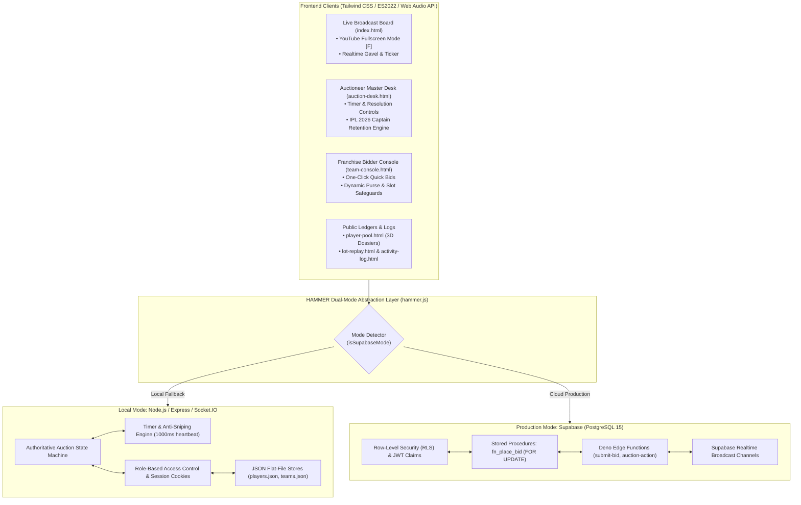

# HAMMER — Realtime Cricket Player Auction Platform (IPL Edition)

```
========================================================================================
                                    SUBMISSION COVER PAGE
========================================================================================
  Participant's Name   : Yash Sahu
  Registration Number  : 25BCE10051
  Date of Submission   : 2 OCT 2026
  Repository Link      : https://github.com/yashsahu0212/Yash-Sahu_25BCE10051_IPL_Auction
  Project Visibility   : Publicly Viewable
========================================================================================
```

---

## 📌 Executive Summary & Architecture Overview

**HAMMER** is an enterprise-grade, server-authoritative, real-time cricket player auction system designed for high-concurrency franchise bidding wars. Emulating the real-world Indian Premier League (IPL) mega auction, the platform provides a live broadcast board, dedicated team owner bidding consoles, an authoritative auctioneer master desk, real-time ledger auditing, and full compliance with BCCI financial and squad retention regulations.

HAMMER features a **Dual-Mode Hybrid Architecture**:
1. **Production-Ready Cloud Mode (Supabase)**: PostgreSQL 15, Row-Level Security (RLS) policies, atomic stored procedures with `FOR UPDATE` pessimistic row locking, GoTrue JWT authentication, Realtime Channels, and Deno Edge Functions.
2. **Offline & Self-Contained Local Mode (Node.js & Socket.IO)**: In-memory state machine, sub-millisecond WebSocket broadcasting, and automated fallback persistence requiring zero external cloud dependencies.



---

##  Key Features

### 1. YouTube-Style Full Screen Mode
- **One-Click Theatre & Stadium View**: Integrated into the Live Broadcast Board (`index.html`) with an interactive fullscreen toggle button and keyboard hotkey (`[F]`).
- **Vendor-Agnostic Engine**: Native browser Fullscreen API integration (`requestFullscreen`, `webkitRequestFullscreen`, `mozRequestFullScreen`, `msRequestFullscreen`) with automated icon and state synchronization on `fullscreenchange` events.

### 2. Official IPL 2026 Franchise Captains Retention Engine
- **Pre-Auction Leadership Lock**: Mirrors real-world IPL retention protocol where franchise captains do not enter the open bidding pool.
- **Roster & Financial Synchronization**:
  - CSK: MS Dhoni (WK)
  - MI: Hardik Pandya (AR)
  - RCB: Virat Kohli (BAT)
  - GT: Shubman Gill (BAT)
  - RR: Sanju Samson (WK)
  - SRH: Pat Cummins (BOWL)
  - DC: Axar Patel (AR)
  - LSG: Nicholas Pooran (WK)
  - KKR: Rinku Singh (BAT)
  - PBKS: Arshdeep Singh (BOWL)
- **Authoritative Gavel Guard**: Retained captains are immediately locked into team rosters at base price, deducting from available purse, decrementing squad slots, and strictly preventing any auctioneer from placing them under the hammer (`ALREADY_SOLD` validation).

### 3. Clock Expiration & Bid Freeze (Anti-Sniping Engine)
- **Zero-Tolerance Timer Guard**: When the clock hits `0s`, bidding is immediately frozen. Subsequent bid requests sent by franchise consoles are rejected with HTTP 400 (`LOT_CLOSED`).
- **Auctioneer Clock Control**: Auctioneers can manually add `+5s`, `+10s`, or `+15s` to the timer at any moment, automatically reopening bidding.

### 4. Auctioneer Lot Resolution Settings (Manual vs. Automatic)
- **Manual (Default)**: Gives the auctioneer full gavel authority (`1st Call`, `2nd Call`, `Fair Warning`, `Gavel Fall`) to sell or pass.
- **Automatic (0s)**: Automatically marks a lot as `SOLD` to the highest franchise when the countdown reaches 0, or `UNSOLD` if no bids were received.

### 5. Multi-Device Real-Time Sync & Rule Enforcement
- **Anti-Race Condition Handling**: Guaranteed atomic ordering for simultaneous bids with expected-bid verification.
- **Rule 7 Compliance**: Strict prevention of self-outbidding (a team holding the highest bid cannot raise against itself).
- **Tiered Bid Increments**:
  - Current bid < ₹100 Lakhs: **+₹10 Lakhs**
  - Current bid < ₹500 Lakhs: **+₹20 Lakhs**
  - Current bid ≥ ₹500 Lakhs: **+₹50 Lakhs**
- **Purse & Minimum Reserve Guard**: Ensures teams retain at least ₹20 Lakhs per remaining unfilled slot up to the mandatory 7-player minimum.
- **Squad Capacity Guard**: Strict roster ceiling enforcement (configurable between 7 and 25 players).

### 6. Official Imagery & Dossiers
- Comprehensive dataset of **73 IPL cricketers** and **10 official franchise crests**.
- High-fidelity **3D flip card dossiers** showcasing batting average, strike rate, wickets, and economy metrics.
- Procedural Web Audio API sound synthesis providing authentic auction hall acoustics (gavel strikes, countdown chimes, bid confirmations).

### 7. Audit Logging & UTF-8 BOM CSV Export
- Immutable auction ledger recording every bid, gavel call, lot opening, and resolution.
- Export to spreadsheet-compliant CSV formatted with UTF-8 Byte Order Mark (`\uFEFF`) to prevent Indian Rupee (`₹`) symbol mojibake.

---

## Tech Stack

| Layer | Technologies |
| :--- | :--- |
| **Frontend UI** | HTML5 (Semantic), Vanilla JavaScript (ES2022 Modules), Tailwind CSS, Custom CSS Variables |
| **Audio Synthesizer** | Native Browser Web Audio API (zero external `.mp3` dependencies) |
| **Local Backend** | Node.js (v18+), Express.js, Socket.IO v4, Cookie-Parser |
| **Cloud Backend** | Supabase (PostgreSQL 15, Row-Level Security, PL/pgSQL Stored Procedures, GoTrue Auth) |
| **Edge Compute** | Deno TypeScript Edge Functions (`submit-bid`, `auction-action`) |
| **Testing** | Node.js Native Test Assertions, Socket.IO Client E2E Harness |

---

## 📁 Clean Repository Structure

```
├── README.md                           # Master project documentation with submission cover page
├── LICENSE                             # MIT Open Source License
├── package.json                        # Project metadata, dependencies, and test scripts
├── server.js                           # Node.js / Express / Socket.IO realtime server
├── index.html                          # Live broadcast screen (YouTube-style fullscreen)
├── auction-desk.html                   # Auctioneer master console (resolution & captain retention)
├── team-console.html                   # Franchise owner bidding tablet/mobile console
├── player-pool.html                    # 73-player official catalogue with 3D flip card dossiers
├── lot-replay.html                     # Archival lot playback and completed auction recap
├── activity-log.html                   # Real-time event audit log with CSV export
├── final-squads.html                   # Post-auction franchise squad breakdown & purse analysis
├── login.html                          # Unified role-based authentication portal
├── unauthorized.html                   # HTTP 403 access-denied landing page
├── .env.example                        # Template for environment configuration
│
├── backend/
│   ├── migrations/
│   │   └── 20260928_init_hammer.sql    # PostgreSQL schema, RLS policies, & concurrency procedures
│   ├── seed.sql                        # Database seed data (franchises, players, users)
│   └── functions/
│       ├── submit-bid/index.ts         # Edge function for authenticated bidding
│       └── auction-action/index.ts     # Edge function for auctioneer hammer controls
│
├── data/
│   ├── players.json                    # 73 IPL cricketers dataset with reserve prices & statistics
│   └── teams.json                      # 10 official IPL franchises with ₹125 Cr purse
│
├── js/
│   ├── hammer.js                       # Unified auction library (Supabase Realtime + Socket.IO)
│   ├── hammer-ux.js                    # Web Audio procedural sound engine and UI helpers
│   ├── player-images.js                # Official IPL player image URL resolver
│   └── supabase-config.js              # Supabase client initializer and telemetry
│
├── css/
│   └── hammer-editorial.css            # Dark mode tokens, 3D card perspective, and custom styling
│
├── tests/                              # Clean, centralized test suites
│   ├── test_timer_and_resolution.js    # Timer expiration, bid cutoff, auto-sold/unsold, and CSV BOM
│   ├── test_captain_retention.js       # IPL 2026 Captain Retention, squad locks, & hammer guards
│   ├── test_supabase_architecture.js   # Supabase RLS, FOR UPDATE locking, & Edge Functions
│   ├── test_final_audit.js             # Route security, RBAC guards, and data integrity
│   ├── test_ipl_rules_demo.js          # Tiered increments, Rule 7, & purse deduction rules
│   └── ...                             # Full E2E & concurrency test scripts
│
├── players/                            # Official player portrait assets organized by franchise
└── logos/                              # Official franchise vector crests
```

---

##  Environment Variables

Create a `.env` file in the workspace root:

```bash
cp .env.example .env
```

| Variable | Required | Description |
| :--- | :--- | :--- |
| `PORT` | Optional (Default: `3000`) | Port on which the local Node.js Express server listens. |
| `NODE_ENV` | Optional (`development` / `production`) | Environment runtime flag. |
| `SUPABASE_URL` | Optional | Supabase project URL (e.g., `https://xyz.supabase.co`). |
| `SUPABASE_ANON_KEY` | Optional | Public anonymous key safe for client-side queries. |
| `SUPABASE_SERVICE_ROLE_KEY` | Optional (Server Only) | Privileged administrative key used by server-side tasks. |

> **Note**: For local offline running, no external cloud API keys are needed! The platform will boot directly into standalone WebSocket mode.

---

## 🏃 Quick Start & How to Run

### Step 1: Clone the Repository
```bash
git clone https://github.com/yashsahu0212/Yash-Sahu_25BCE10051_IPL_Auction.git
cd Yash-Sahu_25BCE10051_IPL_Auction
```

### Step 2: Install Dependencies
```bash
npm install
```

### Step 3: Launch the Platform
```bash
# Start server
npm start

# Or start in live-reload watch mode
npm run dev
```

### Step 4: Open in Browser
Open your browser and navigate to:
- **Live Broadcast Board:** [http://localhost:3000/](http://localhost:3000/) *(Press `[F]` or click full-screen icon)*
- **Auctioneer Control Desk:** [http://localhost:3000/auction-desk.html](http://localhost:3000/auction-desk.html)
- **Franchise Bidder Console:** [http://localhost:3000/team-console.html](http://localhost:3000/team-console.html)
- **Player Pool & 3D Dossiers:** [http://localhost:3000/player-pool.html](http://localhost:3000/player-pool.html)
- **Lot Replay & History:** [http://localhost:3000/lot-replay.html](http://localhost:3000/lot-replay.html)
- **Audit Activity Log:** [http://localhost:3000/activity-log.html](http://localhost:3000/activity-log.html)
- **Post-Auction Squads:** [http://localhost:3000/final-squads.html](http://localhost:3000/final-squads.html)

---

##  Credentials & Access Matrix

| Role | Username | Password | Access Capabilities |
| :--- | :--- | :--- | :--- |
| **Auctioneer** | `auctioneer` | `hammer2026` | Full hammer control, lot launch, gavel, timer override, auto/manual resolution, captain retention. |
| **CSK Owner** | `csk` | `csk2026` | Chennai Super Kings bidding console & real-time squad ledger. |
| **MI Owner** | `mi` | `mi2026` | Mumbai Indians bidding console & real-time squad ledger. |
| **RCB Owner** | `rcb` | `rcb2026` | Royal Challengers Bengaluru bidding console & real-time squad ledger. |
| **Other Franchises** | `gt`, `rr`, `srh`, `dc`, `lsg`, `kkr`, `pbks` | `[teamcode]2026` | Dedicated franchise bidding consoles for all 10 IPL franchises. |

---

## Submission Details

- **Participant's Name:** Yash Sahu
- **Registration Number:** 25BCE10051
- **Date of Submission:** 2 OCT 2026
- **Repository:** [https://github.com/yashsahu0212/Yash-Sahu_25BCE10051_IPL_Auction](https://github.com/yashsahu0212/Yash-Sahu_25BCE10051_IPL_Auction)
- **License:** MIT License
